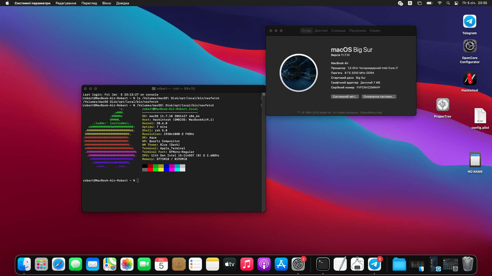

# Hackintosh \ OpenCore for Dell Latitude 5420
This EFI is still under development and is **not** intended for regular use. \
It is intended for informational purposes only.
Please note, that the bootloader is for 5420, **not E5420**

Цей завантажувач ще знаходиться под розробкою, та **не** рекомендується для постійного використання. \
Несе виключно ознайомлювальний посил.
Зауважте, що завантажувач для моделі 5420, **не Е5420**

| >w<

  

## English - translated information text
  

I am **NOT** responsible for your data on disks or the performance of your PC. All actions are on your conscience. Be careful when doing this work. \
Tested on i5-1145G7 and Monterey / Big Sur. Will be updated whenever possible. 

### What works:
+ Display
+ USB and Thunderbolt (as USB3.1)
+ Intel WiFi
+ Intel Ethernet card
+ NVMe drives
+ SD Card Reader
+ Trackpad and keyboard
+ Battery info

### What **NOT** works due to a problem or incompatibility
- iGPU acceleration \
Internal display backlight \
Type-C Video output and HDMI/HDMI-Audio
- Audio and microphone (no layout-id)
- Intel Bluetooth
- AirDrop or Handoff
- I2C Camera

### Modifications & additionally
* SMBIOS set MacBook Air 9,1
* Spoof processor to Ice Lake (10th generation)
* If you find a way to get audio on this laptop with the ALC236 codec, please let me know :з
* I will still try to configure the graphics with modification.. but I do not promise that everything will work out..

 

 

## Ukrainian - оригінальний інформаційний текст

Я **НЕ** відповідаю за ваші дані на дисках або працездатність вашого ПК. Всі дії на вашій совісті. Будьте обережні, виконуючи всі дії. \
Перевірено на i5-1145G7 і Monterey / Big Sur. Буде оновлюватись, по можливості.

### Що працює в системі:
+ Дисплей 
+ USB та Thunderbolt (як USB3.1)
+ карта Intel Ethernet
+ NVMe диски
+ зчитувач SD карт
+ Трекпад та клавіатура
+ Інформація о батареї

### **НЕ** працює через проблеми або несумістність
- Прискорення інтегрованної графіки \
Яскравість внутрішнього дисплею \
Вихід зображення через Type-C чи HDMI, а також HDMI-Audio
- Звук та мікрофон (не знайшов id виходу)
- Intel Bluetooth
- AirDrop чи Handoff
- I2C камера

### Модифікації та додатково
* SMBIOS виставлений як MacBook Air 9,1
* Підміна процесора на Ice Lake (10-е покоління)
* Якщо ви знайдете спосіб завести аудіо на цьому ноутбуці з кодеком ALC236, то скажіть будь-ласка :з 
* Я ще буду пробувати завести графіку з модифікацією.. але не обіцяю що все вийде..

## Additional info \ Додаткова інформація

  

    

### Kext list \ Список кекстів 

- Lilu
- VirtualSMC \
  SMCProcessor \
  SMCDellSensors \
  SMCBatteryManager \
  SMCSuperIO
- Whatevergreen
- AppleALC
- AirportItlwm
- Intel Mausi
- IntelBluetooth* \
  BlueToolFixup
- CPUFriend \
  CPUFriendDataProvider
- CtlnaACHIPort
- SATA-unsupported
- XHCI-unsupported
- USBInjectAll
- Thunderbolt Reset
- ECEnabler
- NVMeFix
- RealtekCardReader
- VoodooI2C \
  VoodooI2CHID \
  AlpsHID \
  VoodooPS2Controller
- BrightnessKeys
- RestrictEvents
- FeatureUnlock
- HibernationFixup
###### Most packages can be found on GitHub or [Builds | Dortania](https://dortania.github.io/builds/)
###### Більшість пакетів може бути знайдені на GitHub або [Builds | Dortania]

  

    

### Screenshots \ Знімки екрану 

### Screenshot from macOS Big Sur 11.7.10
###### знімок екрану з macOS Big Sur

### Screenshot from macOS Monterey 12.7.2
###### знімок екрану з macOS Monterey

## Сonfigure this in \ Налаштуйте це у BIOS (UEFI)
###### here the documentation suggests using version 1.11.2 or higher \ документація передбачає використання версії 1.11.2 або вище 

| Section                 | Subsection                 | Choose                            | Set to    |
| ---                     | ---                        | ---                               | ---       |
| Boot Configuration      | Secure Boot                | Enable Secure Boot                | OFF       |
| Integrated Devices      | Type-C Dock Override       | Type-C Dock Override              | OFF       | 
| Storage                 | SATA/NVME Operation        | SATA/NVME Operation               | ACHI/NVMe |
| Security                | TPM 2.0 Security           | TPM 2.0 Security On               | OFF       |
| System Management       | Wake on LAN                | Wake on LAN                       | Disabled  |
| Virtualization Support  | VT for Direct I/O          | Enable Intel(R) VT for Direct I/O | OFF       | 

## Thanks \ Дяка
#### [Dortania's OpenCore Install Guide](https://dortania.github.io/OpenCore-Install-Guide/)
#### [lshbluesky](https://github.com/lshbluesky) - for the hope of configuring Iris Xe
###### за надію на налаштування Iris Xe
#### [NTHT1MD](https://github.com/NTHT1MD) - as a base for this EFI, taken from [...](https://github.com/NTHT1MD/Hackintosh_Opencore_HP-Pavilion-X360-dw1016TU-i3?tab=readme-ov-file)
###### за основу для цього EFI, взято з ...
